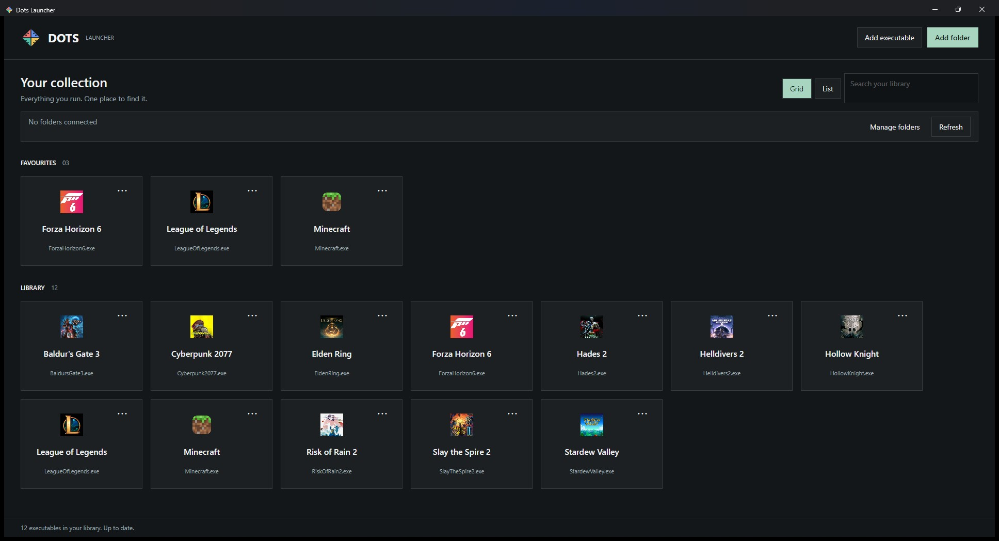

# Dots Launcher

Dots Launcher is a square-edged desktop launcher for Windows, Linux, and macOS. It collects applications from folders, displays their icons, and keeps favourites, launch arguments, custom titles, custom icons, search, multi-select, and grid/list views in one library.

## Preview



## Downloads

GitHub Releases produce self-contained builds; no .NET installation is required.

- `DotsLauncher-win-x64-portable.zip` — Windows 10/11 x64. Extract and run `DotsLauncher.exe`.
- `DotsLauncher-win-arm64-portable.zip` — Windows 11 ARM64.
- `DotsLauncher-linux-x64.tar.gz` / `linux-arm64` — extract, then run `./DotsLauncher`.
- `DotsLauncher-osx-arm64.zip` — Apple Silicon Mac.
- `DotsLauncher-osx-x64.zip` — Intel Mac.

Windows portable archives include `portable.flag`, so the library is stored in the adjacent `data` folder. Other builds use the operating system's local application-data directory. `--portable` enables adjacent storage on any platform; `--data-dir PATH` chooses an explicit location.

### Windows publisher and SmartScreen

An unsigned Windows build displays **Unknown publisher** and can trigger Microsoft Defender SmartScreen. The release workflow supports Microsoft Artifact Signing so tagged releases can carry a verified publisher identity. Configure an Artifact Signing account with a Public Trust certificate profile and add these repository Actions secrets:

- `AZURE_CLIENT_ID`
- `AZURE_TENANT_ID`
- `AZURE_SUBSCRIPTION_ID`
- `AZURE_ARTIFACT_SIGNING_ENDPOINT`
- `AZURE_ARTIFACT_SIGNING_ACCOUNT`
- `AZURE_ARTIFACT_SIGNING_CERTIFICATE_PROFILE`

The Windows jobs sign and verify `DotsLauncher.exe` before creating the portable archives. Tagged releases fail instead of publishing an unsigned Windows executable when signing is not configured. New certificates and binaries can still show an initial SmartScreen reputation warning; using the same trusted signing identity for every release allows reputation to accumulate. Microsoft Store distribution is the only option that avoids SmartScreen download warnings immediately.

The macOS archives are unsigned development builds. On first launch, use **Open** from Finder's context menu if Gatekeeper blocks the app. Signing and notarization require an Apple Developer identity.

## Platform support

- Windows: `.exe` files.
- Linux: files with an executable permission bit.
- macOS: `.app` bundles and executable files.

Folder connections scan immediately, watch for changes, and include subfolders by default. **Manage folders** changes recursive scanning or removes a folder connection. Removing an item from Dots Launcher leaves its file on disk.

The three-dot menu provides **Launch Executable**, **Add To Favourites**, **Browse Local File**, **Edit Profile**, and **Remove from Launcher**. Hover **Select** to enter multi-select mode. The separator above removal spans the complete context-menu width.

## Development

Requires the .NET 10 SDK.

```powershell
dotnet build DotsLauncher/DotsLauncher.csproj -c Release
dotnet run --project DotsLauncher.Tests/DotsLauncher.Tests.csproj -c Release
```

Push a tag such as `v1.1.0` to run `.github/workflows/release.yml`. GitHub Actions tests the core, builds x64 and ARM64 releases on native Windows, Ubuntu, and macOS runners, then attaches all six archives to a GitHub Release.

## License

MIT
